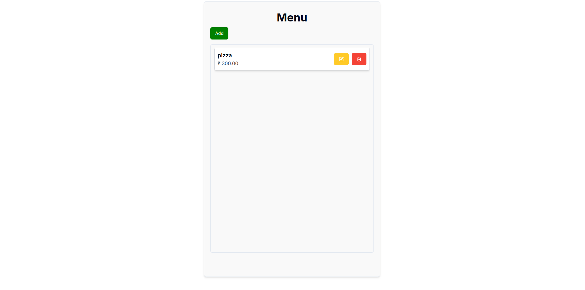

# Menu App

Frontend code base for the Menu app

## Contents

- [About](#About)
- [Features](#Features)
- [Tech Stack](#Tech)
- [Installation](#Installation)
- [Production](#production)
- [Deployment](#deployment)
- [Demo](#demo)
- [Acknowledgements](#acknowledgements)

## About

This is a Menu Management Application built using ReactJS, TailwindCSS and NextJS. It allows users to view, add, update, and delete menu items. The app utilizes client-side rendering features and follows modern development practices.

## Features

- View a list of menu items
- Add new menu items
- Update existing menu items
- Delete menu items

## Tech Stack

- **TypeScript**: JavaScript with syntax for types.
- **NextJS**: The React Framework for the Web.
- **ReactJS**: The library for web and native user interfaces.
- **Tailwind CSS**: A utility-first CSS framework.
- **Shadcn/ui**: Beautifully designed components that can we copy and paste into our apps.
- **Zod**: TypeScript-first schema validation with static type inference.
- **React Hook Forms**: Performant, flexible and extensible forms with easy-to-use validation.

## Installation

1. Clone the repository:

   ```sh
   git clone https://github.com/sravanpant/Full_Stack_App_Next_Frontend
   cd Full_Stack_App_Next_Frontend
   ```

2. Install dependencies:

   ```sh
   npm install
   ```

3. Run the development server:

   ```sh
   npm run dev
   ```

4. Open [http://localhost:3000](http://localhost:3000) in your browser to view the app.

## Production

To create an optimized production build, run:

```sh
npm run build
```

## Deployment

The easiest way to deploy your Next.js app is to use the [Vercel Platform](https://vercel.com/) from the creators of Next.js.

Check out the [Next.js deployment](https://nextjs.org/docs/app/building-your-application/deploying) documentation for more details.

## Demo



## Acknowledgements

- [Menu Project Blog](https://dev.to/koladev/building-a-fullstack-application-with-django-django-rest-nextjs-3e26)
- [TypeScript](https://www.typescriptlang.org/docs/)
- [NextJS](https://nextjs.org/docs)
- [ReactJS](https://react.dev/)
- [TailwindCSS](https://tailwindcss.com/docs/installation)
- [Shadcn/ui](https://ui.shadcn.com/docs)
- [Zod](https://zod.dev/)
- [React Hook Forms](https://react-hook-form.com/get-started)
